<div align="center">

<h3><code>anaserchicha08@github ~ $ figlet anaserchicha08</code></h3>



<br>

<h3><code>anaserchicha08@github ~ $ ./contributions.sh</code></h3>



<br><br>

<h3><code>anaserchicha08@github ~ $ neofetch</code></h3>

<table>
  <tr>
    <td valign="top"></td>
    <td valign="top" align="left">

**`$ ls ./projects/`**

📡 **[Networking Docs Series](https://github.com/anaserchicha08-web/documenting-)** — Daily technical deep-dives on networking & CS concepts (20 concepts, 1/day)

<br>

**`$ cat ./stack.txt`**

```
Languages  : JavaScript · Python · Bash
Runtime    : Node.js
Topics     : Networking · Cloud · DevOps
Learning   : CCNA · Linux · Automation
```

<br>

**`$ cat ./stats.txt`**


  </td>
  </tr>
</table>

<br>

<sub><code>🔄 Heatmap auto-refreshes daily via GitHub Actions</code></sub>

</div>
